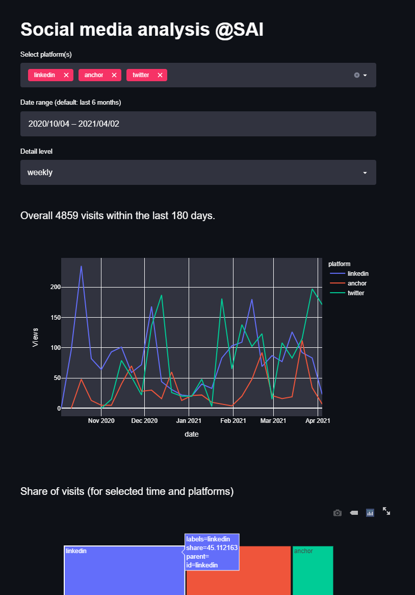
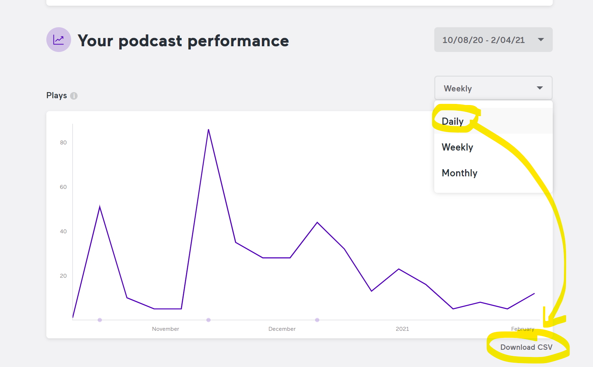
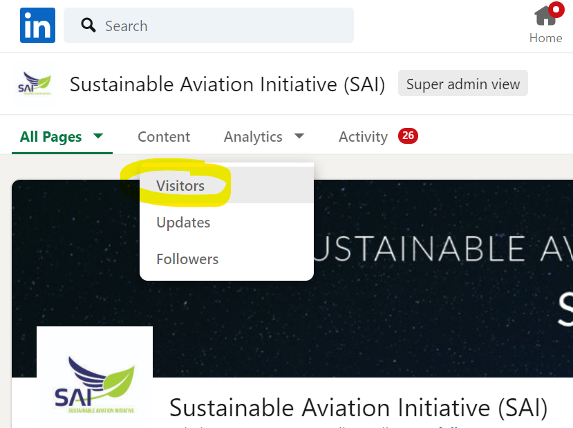
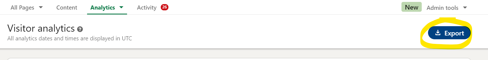
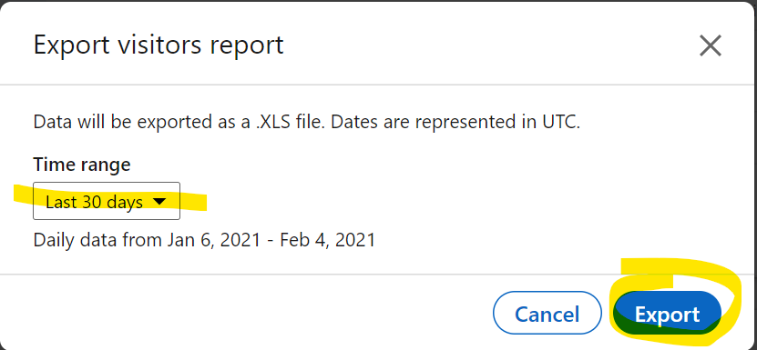
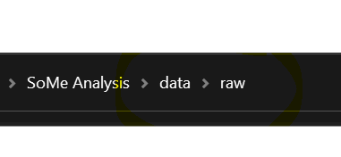
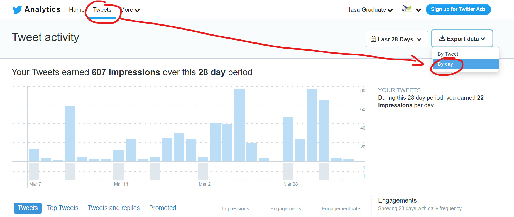

# Sustainable aviation initiative - Data Science

We push for more sustainable air travel through data-driven insights with data science at Sustainable aviation initiative (SAI). We are a diverse group with volunteers of all ages, interests and backgrounds. Aviation enthusiasts of all areas join forces to make air travel ready for a sustainable future. 

This repository collects useful scripts, projects and analyses.  

## Join us
We would love to hear from you. Leave us a message at https://www.linkedin.com/company/sustainableaviationinitiative. 


# Social media analysis

## **Goal**
>
> Have one dashboard to summarizes SAI's reach across platforms. 
> KPI is **Total unique visitors per week**.

## Structure

```bash
./ Project root
├───data
│   ├───interim
│   ├───processed
│   └───raw
├───env             # contains conda environment.yml to create conda env
├───notebooks       
├───references
│   └───images      # used for readme
└───src
    ├───app         # contains streamlit app dashboard.py
    │   └───util    # utility functions
    └───data        # data processing script
```

## Get started (developers)

The following assumes the python package manager Anaconda/Minconda. First, 

1. setup your conda virtual environment to be able to run the code

    2. open the anaconda cmd in your project folder
    3. navigate to `./env` and run c`onda env create -f environment.yml`
    4. Ensure that your python builder points to the `python.exe` from the environment we just created. For example, I use the project settings in Sublime to point to the `python.exe` of the `sai` virtual environment. See below for my exemplary project settings. 
```json
{
    "build_systems":
    [
        {
            "name": "Anaconda Python Builder",
            "selector": "source.python",
            "shell_cmd": "C:/Users/phili/Miniconda3/envs/sai/python.exe -u \"$file\""
        }
    ],

    "folders":
    [
        {
            "name": "SAI social media analysis",
            "path": "[MY PROJECT PATH]"
        }
    ]
}
```
2.  ensure that data files exists for Anchor and LinkedIn in `./data/raw/`
3.  You find the data processing script in `./src/data/process_data.py`. Change the data directories according to your OS and needs. 


### Develop Streamlit app locally
Refer to [Streamlit's](https://docs.streamlit.io/en/stable/getting_started.html) official get started guide. 

Follow the above steps to install environment or run

```bash
pip install streamlit pandas plotly
```

Go to `./src/app`, open an anaconda prompt `conda activate sai` and 

```bash
streamlit run streamlit_app.py
```

A browser should open and show 



### Deploy with Streamlit Share

A checklist for deployment on [Streamlit Sharing](https://streamlit.io/sharing): 

1. Ensure a _public_ repository 
2. A repository with submodules or subdirectories will not work. 
3. Put `requirements.txt` into the repository root folder `./` with a minimum amount of packages, for example 
    ```bash
    pandas==1.2.3
    pyyaml==5.4.1
    streamlit==0.79.0
    plotly==4.14.1
    ```
4. Any files called from within `./src/app/streamlit_app.py` have to be called relative to the root folder of the repo, `./`. Relative paths from `streamlit_app.py` will not work, so always start at the repository root `./`, for example: 
    ```python
    # calling settings.yml with relative path does not work
    with open('../settings.yml') as file: 
        [...]
    # call settings.yml from repo root dir
    with open('./src/settings.yml') as file: 
    ```


## How to add new data

To add new data points after a certain time, proceed as follows. __Important:__ Store the data in the directory, where  `./src/data/process_data.py` expects it to be. This is `./data/raw` by default. 

### AnchorFM



### LinkedIn 






### Twitter 

You find the analytics data as follows: 

`More` > `analytics` > `Tweets`
Select _last 28 days_ and _Export data __by day___ to the project data folder `./data/raw`.



## Purpose of the jupyter `./notebooks`

Explore ways to merge social media data across platforms. Make **daily** follower statistics from `linkedin` and `anchorfm` (manually) accessible. Focus on the **total sum**, such as **Total page views** or **Total plays**.

### Implementation

1. load files from directory, where the raw data lives (e.g. `../../data/raw`)
3. create a common `date` column with datetime format *UTC*
4. drop date duplicates
4. transform into long format which yields:

    |   |                      date | platform |  value |
    |--:|--------------------------:|---------:|------:|
    | 0 | 2020-10-08 00:00:00+00:00 |   anchor |  0.0 |
    | 1 | 2020-10-09 00:00:00+00:00 |   anchor |  0.0 |
    | 2 | 2020-10-10 00:00:00+00:00 |   anchor |   0.0 |

4. export as csv, e.g. to `../../data/processed`
