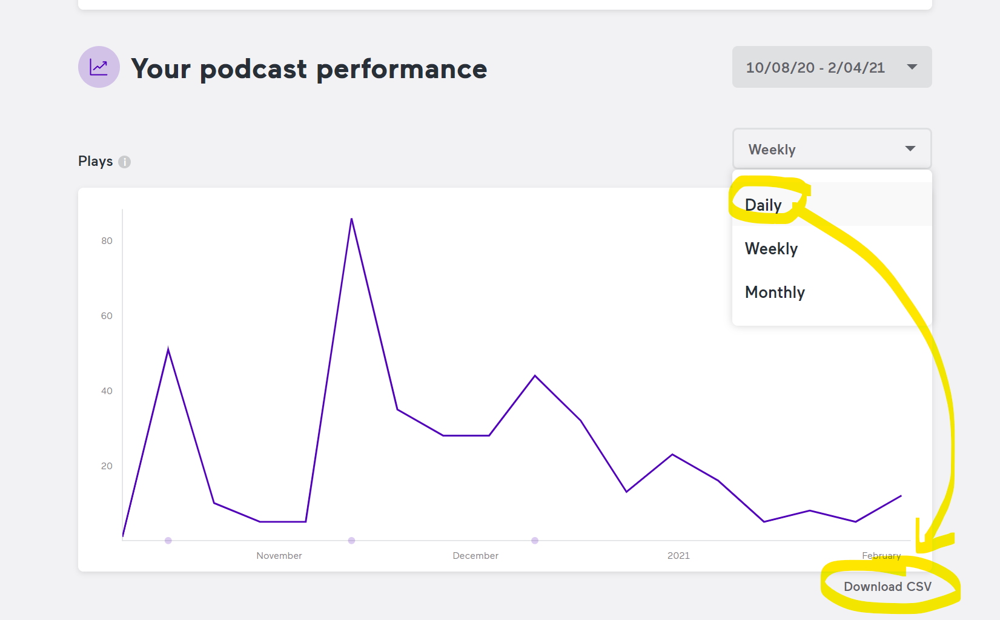
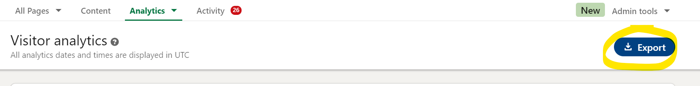
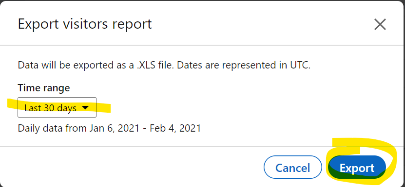
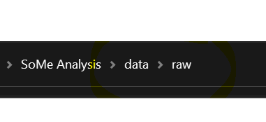

# Linkedin, AnchorFM follower analysis

## **Goal**
>
> Have one dashboard to summarizes SAI's reach across platforms. 
> KPI is **Total unique visitors per week**.


## Get started (developers)

The following assumes the python package manager Anaconda/Minconda. First, 

1. setup your conda virtual environment to be able to run the code

    2. open the anaconda cmd in your project folder
    3. navigate to `./env` and run c`onda env create -f environment.yml`
    4. Ensure that your python builder points to the `python.exe` from the environment we just created. For example, I use the project settings in Sublime to point to the `python.exe` of the `sai` virtual environment. See below for my exemplary project settings. 
```json
{
    "build_systems":
    [
        {
            "name": "Anaconda Python Builder",
            "selector": "source.python",
            "shell_cmd": "C:/Users/phili/Miniconda3/envs/sai/python.exe -u \"$file\""
        }
    ],

    "folders":
    [
        {
            "name": "SAI social media analysis",
            "path": "[MY PROJECT PATH]"
        }
    ]
}
```
2.  ensure that data files exists for Anchor and LinkedIn in `./data/raw/`
3.  You find the data processing script in `./src/data/process_data.py`. Change the data directories according to your OS and needs. 

## How to add new data

To add new data points after a certain time, proceed as follows. __Important:__ Store the data in the directory, where  `./src/data/process_data.py` expects it to be. This is `./data/raw` by default. 

### AnchorFM



### LinkedIn 






## Purpose of the jupyter `./notebooks`

Explore ways to merge social media data across platforms. Make **daily** follower statistics from `linkedin` and `anchorfm` (manually) accessible. Focus on the **total sum**, such as **Total page views** or **Total plays**.

### Implementation

1. load files from directory, where the raw data lives (e.g. `../../data/raw`)
3. create a common `date` column with datetime format *UTC*
4. drop date duplicates
4. transform into long format which yields:

    |   |                      date | platform |  value |
    |--:|--------------------------:|---------:|------:|
    | 0 | 2020-10-08 00:00:00+00:00 |   anchor |  0.0 |
    | 1 | 2020-10-09 00:00:00+00:00 |   anchor |  0.0 |
    | 2 | 2020-10-10 00:00:00+00:00 |   anchor |   0.0 |

4. export as csv, e.g. to `../../data/processed`
